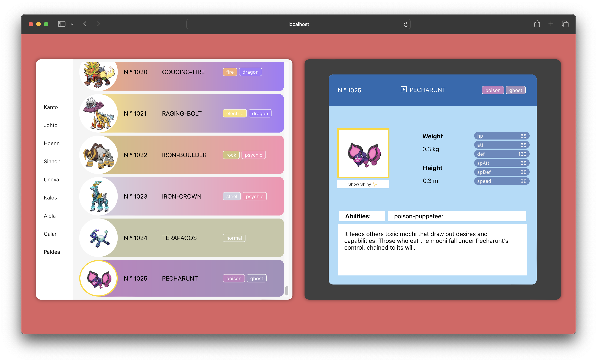

# Pokedex

This project is a Pokedex, a web application that allows you to explore information about different Pokémon. It was developed as part of a practice exercise to learn to use Redux Toolkit.

### Technologies Used:

- **React:** The application is built using React to create a dynamic and responsive user interface.

- **Redux Toolkit:** Redux Toolkit is used to efficiently manage the application state, making it easier to handle data and communication between components.

- **Axios:** Axios is used to make calls to the PokeAPI and fetch the necessary data about the Pokémon.

## Key Features:

- Explore the complete list of Pokémon.
- View details of a specific Pokémon, such as its type, abilities, and statistics.
- Interact with an intuitive and user-friendly interface.

## Demo:
Visit the [live demo](https://amandalimon.github.io/react-redux-pokedex/) to try out the application!

